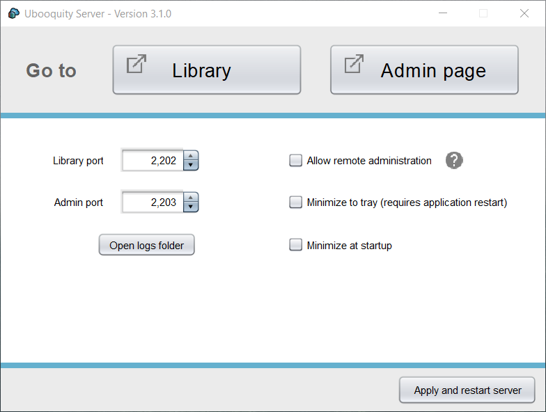
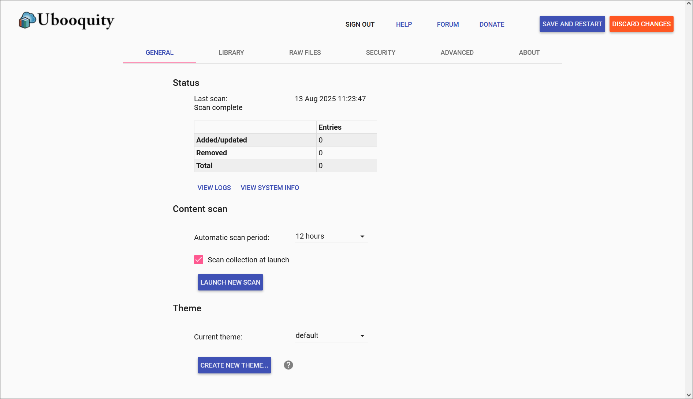

Ubooquity can be deployed in a few minutes on any desktop computer (Windows, Linux or MacOS).  
As Ubooquity does not modify any file outside of its own directory, you can easily try it out this way before installing it elsewhere.

NB: to run Ubooquity using the command line, on a NAS for instance, read the [User Manual](manual.html)

## Requirements

Ubooquity server requires **Java 17**.  
You can download a Java Runtime Environment (JRE) on the [Eclipse Temurin page](https://adoptium.net/en-GB/temurin/releases), although any other Java distribution can be used as well.

## Installation

* First, download the Ubooquity package from the [download page](http://vaemendis.net/ubooquity/static2/download).  
* Unzip the downloaded file in a dedicated folder of your choice (the folder must be empty, Ubooquity will create here [all the files](dir-structure.html) it needs to function).
* Double-click on the **Ubooquity.jar** file.

Ubooquity is now running and displays its desktop interface:

## Configuration

The only remaining thing to do is to choose which folders you want to share.

* Click on the **Admin screen** button. The administration page will open in your browser, asking you to choose an adminstrator password.  
* Once you've chosen one (and entered it again to log into the administration zone), click on the **Library** section.
* Just click on the **Add folder** button, share a folder and you're almost done.
* Don't forget to click on the **Save and restart** button (upper right corner). 

You're all set!  
Go back to the desktop interface and click on the **Library** button to access your books.

## Going further

The [User Manual](manual.html) contains much more information about what you can do with Ubooquity.

In case you prefer to learn as you go, here are a few useful tips to get you started:

* As long as Ubooquity is not running, you can move its folder anywhere you want on your device. Ubooquity has all it needs in its own folder.
* By default, the admin page cannot be reached from another machine. You must activate the "Allow remote administration" option (either in the desktop interface or using command line options) to do that.
* To access Ubooquity from another device (from your local network or from the Internet), don't forget to properly configure your firewall and/or router.
* If you ever need to reset your administrator password, just delete the *webadmin.cred* file in the Ubooquity folder.
