_written by Matthew Sanders_

> Do you want Ubooquity to display more than the filename of your comic files?
Follow this tutorial to scrape and save comicvine metadata to your comics.

## Requirements

1. ComicRack comic organizing tool
2. ComicRack Comicvine scraper by Cory Banack
3. Comicvine API key

## Steps

1 - **Press CTRL+F9 or go to Edit > Preferences to open the preferences dialog**  

2 - **Go to the advanced tab and make sure the following options are checked**  

* Allow writing of Book info into files
* Book files are updated automatically

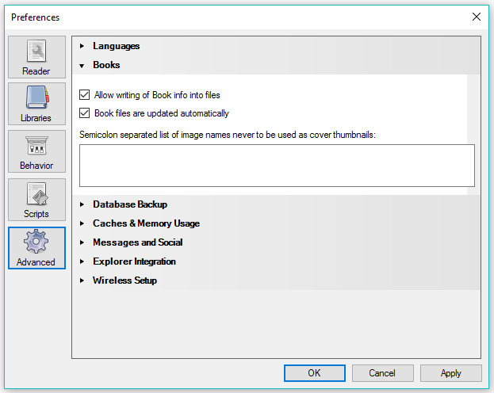

3 - **Create a new smart list by right-clicking on "Smart Lists" within the left information panel in ComicRack**  
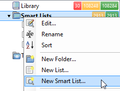

4 - **This list will show your unscraped files. Fill in the smart list rules to show files where 'Notes' does not contain 'cvdb'**  

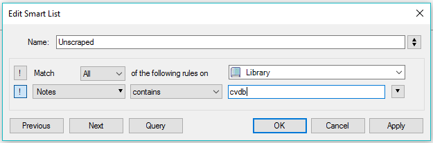

5 - **Download the Comicvine scraper .crplugin file from Cory's github page. Drag it into the ComicRack preferences Scripts tab then restart ComicRack**  

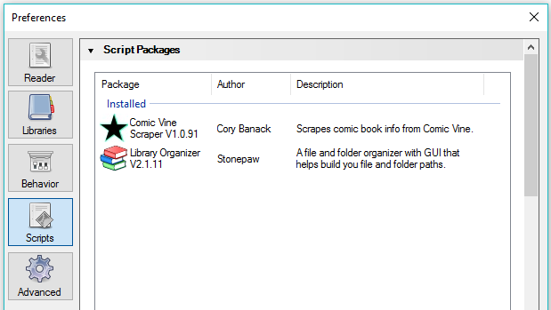

6 - **Select the comic files you want to scrape**  

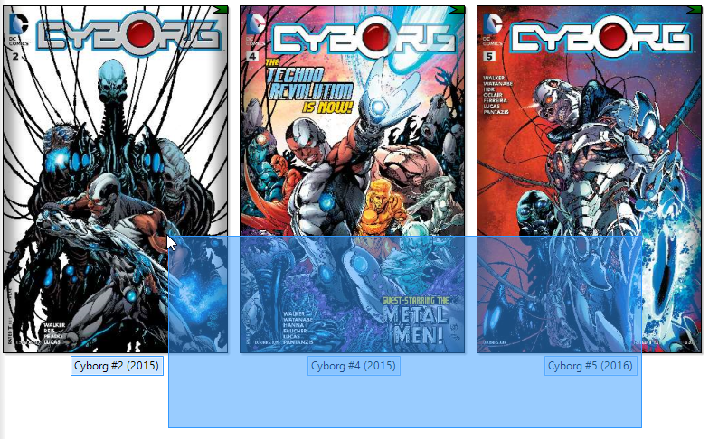

7 - **Click the green scraper star in the top navigation bar to start the scraper**  

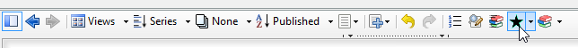

8 - **A new window will open. Click the settings button and paste your Comicvine API key in to the text field in the Comic Vine tab**  

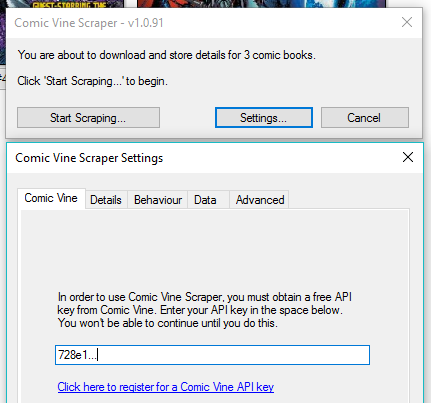

9 - **Go to the behaviour tab and choose to save the metadata to the notes field**  

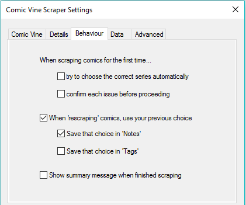

10 - **Go to the advanced tab and paste the content of the ''scraper filter'' page in to the box (see link below). This is a good starting point for you to be able to filter the search results when scraping a file. Feel free to add to your list of filters as you come across them**  

[*Scraper filter*]({{ site.baseurl }}/pages/tutorials/add-metadata-with-comicrack_scraper-filter.html)

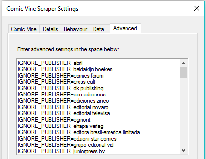

11 - **After scraping your files you should see a yellow star in the bottom left of your cover thumbnails. That icon signifies that the file is waiting to be saved**  

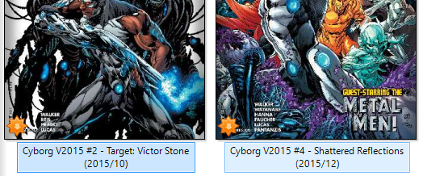

12 - **Go to your smart list that shows which files are waiting to be saved. If you don't have this list you can create it by filtering for Modified Info "is Yes"**  

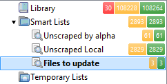

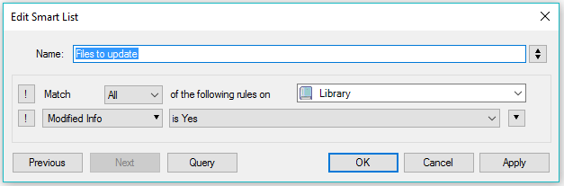

13 - **Set the library view to not grouped, stacked by file format and not sorted to be able to update all the files at one time**  

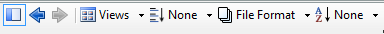

14 - **Right click the stack of files and choose "Update Book Files"**  

## Tip

Ubooquity will use the new metadata saved in your cbz files, but not until you perform a rescan of your files!

If some of your files are not being updated with their new metadata then they are probably not zip packed. You can use ZenCBR to check your files for the appropriate extension. Sometimes cbz files are saved as cbr and vice versa. Then use, or skip right to using, comicrack to convert every file that isn't a cbz in to a cbz by right clicking the files and choosing “Export Books” > “Convert to CBZ”.

