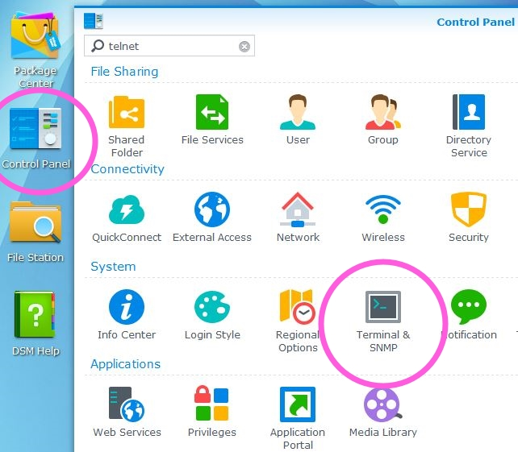
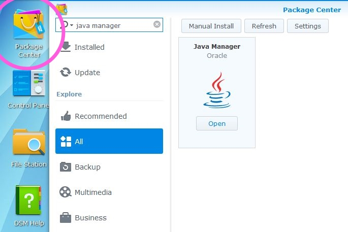
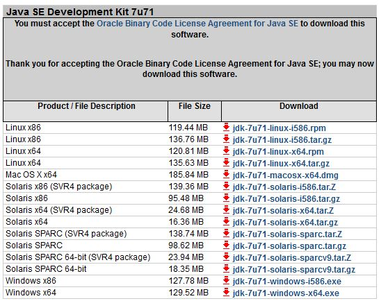
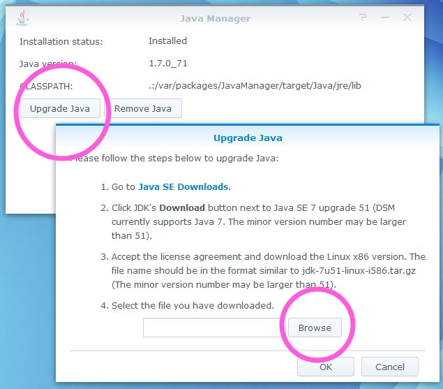
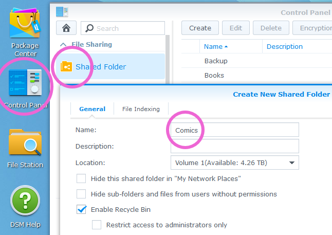
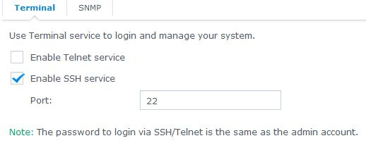
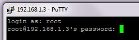
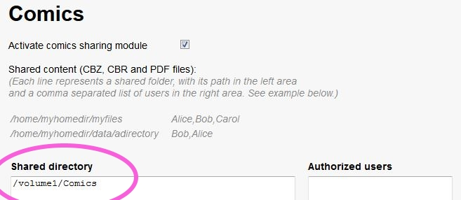

This tutorial has been written quite a long time ago. The information it contains might be outdated. 

_written by Matthew Sanders_

>I recommend that you assign a static local IP address to your server through your router. This enables you to bookmark the Ubooquity web interface.

>In this tutorial, 192.168.1.2 is used as an example of local IP for a Synology NAS. Replace it with your own.

## Requirements

1. [Synology](https://www.synology.com/en-us/products/) brand NAS
1. A Synology model capable of running the Java. Most recent models would run Java manager, check [this page](https://www.synology.com/en-uk/dsm/app_packages/JavaManager) for a list of applicable models. If your model is not listed try installing Java using [this separate tutorial](http://pcloadletter.co.uk/2011/08/23/java-package-for-synology/).
1. Internet access
1. Synology DSM version 5 or greater

### Summary

1. Install Java JRE 8 or greater on your server,
1. Create a shared folder to serve as repository for all your comics and books
1. Download the Ubooquity jar to a convenient place on your server,
1. Tell you box to run ubbooquity on boot, 2 options here:
    * Create an Upstart script in /etc/init (requires ssh access to your box),
    * Use Synology's task scheduler (requires DSM6.0 at least) 
1. Use the web interface to configure Ubooquity

> **UPDATE 2016-11-19**
> ssh procedure (Tested on Synology ds215j, running DSM 6.0.2-8451 Update 4) Java Manager application is not available on tested DSM SW/HW combination. Luckily it's not necessary because Synology issued packages Java7 and Java8 that are platform specific so the process is even simpler. Just install the Java package and skip to next step. Ubooquity 1.10.1 definitely works with Java 8. 

> **UPDATE 2017-11-22**
> ssh procedure tested on Synology ds418+, with DSM 6.1 and Ubooquity 2.1.1
> task scheduler procedure tested on synology ds418+ [see forum]

## Configure the Synology NAS

#### Summary

* Use the Java Manager app supplied by Synology to install the latest JRE
* Create a shared folder as repository for all comics and ebooks files

#### Steps

1. Open the webadmin interface 192.168.1.2:5000. Log in to the DSM and open the Control Panel  

2. Open the Package Center and install the Java Manager.  

3. Open the Java Manager application and follow the instructions to download the most recent Java SE Development Kit for your server architecture then choose the archive you downloaded and use it to install Java.  
)

4. Create a shared folder titled “Comics”.  

## Procedure with upstart script

#### Requirement

* ssh must be anabled on your box for this procedure

if not already done: enable ssh access on your box
1. Open the webadmin interface 192.168.1.2:5000. Log in to the DSM and open the Control Panel  

1. Open the Terminal & SNMP tab and enable the SSH service.  

For security: it is usually recommanded to modify the ssh port to somthing less usual if you want to ssh your box open on internet

#### Summary

* SSH in to your server using your admin password, but as the root user
* Browse to /var/packages/,  download the Ubooquity archive, and Unarchive Ubooquity.zip
* Create an upstart script in /etc/init and start the jar

#### Steps

> **UPDATE DSM 6**
> Login with root is not possible anymore on DSM 6. Replace step 2 with the following 3 steps
> 1. Login with admin and your admin password
> 2. enter; sudo -i
> 3. enter your password 

1. If you are using Windows download and run the [Putty SSH client](http://www.chiark.greenend.org.uk/~sgtatham/putty/download.html).
2. Connect to your server through SSH at 192.168.1.2 then log in as the root user using the admin password. That is the same user you used to log in to the Synology DSM web interface.  

3. Browse to /var/packages/ using the command 
    cd /var/packages
4. Create the Ubooquity directory then enter it with `[ -d Ubooquity ] || mkdir Ubooquity && cd Ubooquity`
5. Download the Ubooquity archive with `wget -O ubooquity.zip http://vaemendis.net/ubooquity/service/download.php`
6. Unzip the archive then remove it with `7z x ubooquity.zip && rm ubooquity.zip`
7. Move to the Synology Upstart services directory (all services listed in this directory are started on boot) with `cd /etc/init`
8.  Download the Ubooquity service script with `wget https://vaemendis.github.io/ubooquity-doc/assets/files/install-synology/ubooquity.conf`
9. Make the service script executable with `chmod 755 ubooquity.conf`
10. adapt the script to your environment if needed; you need to know vi to do this from ssh terminal; alternatively you can edit the script in your prefered text editor and then copy the modified script to cd `cd /etc/init`

The Ubooquity service is now installed. It will start on boot and you can start or stop it at anytime using `start ubooquity` or `stop ubooquity`. You can also see the status of the ubooquity processs unsing `status ubooquity`

**NOTE if Java8 is used**

If you used Synology Java8 package instead of Java Manager then the service script will have the wrong path to the java binary. Edit the `/etc/init/ubooquity.conf` and change path to java binary from: 

`exec /var/packages/JavaManager/target/Java/bin/java -jar -Xmx1024m /var/packages/Ubooquity/Ubooquity.jar -port 2202 -webadmin -workdir "/volume1/Comics/Ubooquity"`

to

`exec /var/packages/Java8/target/j2sdk-image/bin/java -jar -Xmx1024m /var/packages/Ubooquity/Ubooquity.jar -port 2202 -webadmin -workdir "/volume1/Comics/Ubooquity"`

## Procedure with task manager

### Requirement

* requires DSM 6.0 or greater

### Summary

* create a ubooquity.sh script and save it on your box
* use task manager to tell your box to launch the script on startup

### steps

1. Download the Ubooquity service script and save it on your server
Look at the script used by user Eren on forum http://ubooquity.userecho.com/forums/1-general/topics/496-script-for-ubooquity-202-on-synology/

adapt the script to your environment and save it  as ubooquity.sh on your server

2. go in control panel, open 'task manager'

3. create a task in "planned tasks" with 2 options
    * launch on boot
    * use a script ubooquity.sh file from one of my shared folder

That's it! it should start ubooquity automatically eveytime you restart your box
To start ubooquity now without having to restart your box, simply run 'execute' from the web interface

## Configure Ubooquity

#### Summary

* Browse to the Ubooquity administrator page
* Set the admin password
* Add your comics directory, enable OPDS then initiate a scan

#### Steps

1. The Ubooquity web interface should be running at `192.168.1.2:2202`. Go to `192.168.1.2:2202/admin` and you will be asked to set the administrator password. Set the password.  
2. Edit the comics settings and add `/volume1/Comics` in the shared directory text area.  

3. Edit the advanced settings. Enable OPDS and add `.*Ubooquity` to the scan exclusion pattern.   

4. Scroll to the top of the admin page to the General area and click 'Launch new scan'. Your comics are now available at `192.168.1.2:2202` and should be bookmarked.

